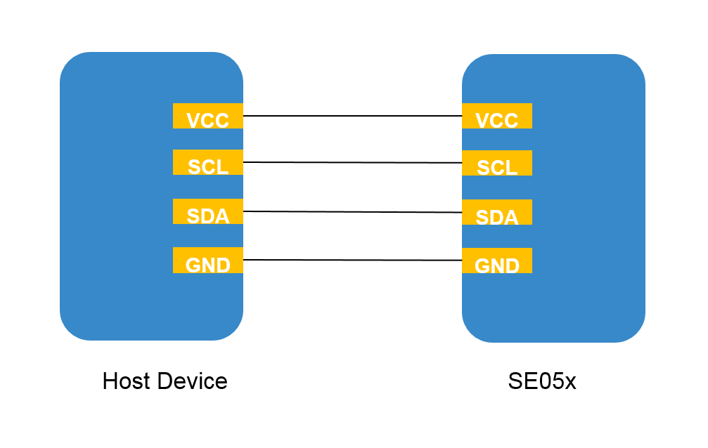
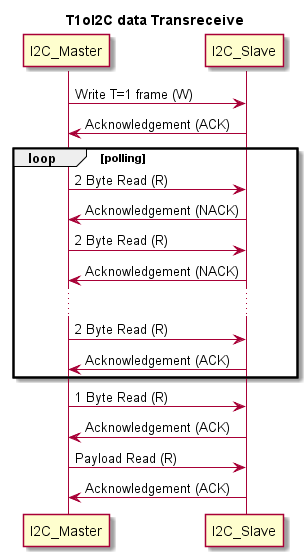

..
    Copyright 2019,2020 NXP

.. highlight:: shell

.. _aosp-setup:

==========================================================
 AOSP build Environment Setup
==========================================================

.. _aosp-hikey960:

AOSP build Environment for Hikey960
^^^^^^^^^^^^^^^^^^^^^^^^^^^^^^^^^^^^^^^^^^^^^^^^^^^^^^^^^^

To setup Android build environment for Hikey960 board please follow steps below:

1) The build setup file structure should be as below::

        <ROOT-DIR>
        |
        |------ android-root/
        |
        |------ simw-top/

2)  Downloading and building AOSP source code
    (refer https://source.android.com/setup/build/devices).

    In the steps below, :file:`android-root` means :file:`${ROOT_DIR}/android-root/`.

    For simplicity of scripts, it is assumed that ``ROOT_DIR`` variable is set like as below::

        ROOT_DIR=/opt/_ddm/aospbld

#)  Setup REPO Tool::

        mkdir ~/bin
        PATH=~/bin:$PATH
        curl https://storage.googleapis.com/git-repo-downloads/repo > ~/bin/repo
        chmod a+x ~/bin/repo

#)  Download source code using REPO tool::

        ROOT_DIR=/opt/_ddm/aospbld # For example

        mkdir -p ${ROOT_DIR}/android-root
        cd ${ROOT_DIR}/android-root

        repo init -u https://android.googlesource.com/platform/manifest -b android-p-preview-2
        repo sync -j$(nproc)

    All scripts from here on assume ``ROOT_DIR`` is set.

#)  Apply patches from ``android.googlesource.com``::

        cd ${ROOT_DIR}/android-root/prebuilts/tools
        git fetch https://android.googlesource.com/platform/prebuilts/tools refs/changes/02/682002/1 && git cherry-pick     FETCH_HEAD

        cd ${ROOT_DIR}/android-root/external/e2fsprogs/
        git fetch https://android.googlesource.com/platform/external/e2fsprogs refs/changes/05/683305/1 && git  cherry-pick FETCH_HEAD

        cd ${ROOT_DIR}/android-root/external/f2fs-tools
        git fetch https://android.googlesource.com/platform/external/f2fs-tools refs/changes/06/683306/1 && git     cherry-pick FETCH_HEAD

#)  Apply patches from host library.

    These patches are for Android Keymaster 3.0 Board init

    Scripts to apply the patches::

        cp ${ROOT_DIR}/simw-top/akm/src/Board_init/keymaster_sepolicy.patch ${ROOT_DIR}/android-root/system/sepolicy/
        cd ${ROOT_DIR}/android-root/system/sepolicy/
        patch -p1 < keymaster_sepolicy.patch

        cp ${ROOT_DIR}/simw-top/akm/src/Board_init/init_rc_file.patch ${ROOT_DIR}/android-root/system/core/
        cd ${ROOT_DIR}/android-root/system/core/
        patch -p1 < init_rc_file.patch

    -   :file:`init_rc_file.patch` is to update system ownership of I2C module and
        to create ``/data/vendor/SE05x`` secure directory.

    -   :file:`keymaster_sepolicy.patch` is to update SE050 Keymaster HAL policy for
        accessing I2C device for communication with SE050 and ``/data/vendor/SE05x``
        secure directory for storing Platform SCP03 keys.

#)  Follow below instructions to build source code for hikey960::

        cd ${ROOT_DIR}/android-root
        export ANDROID_ROOT=$(pwd)
        source build/envsetup.sh
        lunch hikey960-userdebug
        make -j $(nproc)

    .. note:: Based on CPU core, build will take 1-4 hrs.

#)  Installing images.

    Follow https://source.android.com/setup/build/devices#960fastboot

#)  Flashing images.  Follow https://source.android.com/setup/build/devices#960images

    .. note:: "fastboot" and "adb" are required for flashing images.

#)  If modifications are required to hikey kernel (e.g. add/remove device driver),
    please refer to https://source.android.com/setup/build/devices#960kernel
    for bulding hikey kernel and follow the instruction given on link
    to create new bootimage image.

AOSP build environment for iMX8M (coming soon)
^^^^^^^^^^^^^^^^^^^^^^^^^^^^^^^^^^^^^^^^^^^^^^^^^^^^^^^^^^

To setup Android build environment for iMX8M board please follow below steps

1. The build setup file structure should be like (your${ROOT_DIR} dir)::

        <ROOT-DIR>
        |
        |------ android-root/
        |
        |------ simw-top/

#)  Downloading and building AOSP source code (refer section 3.2.3 : Build your own Android BSP
    Image from https://www.nxp.com/support/developer-resources/run-time-software/i.mx-developer-resources/evaluation-kit-for-the-i.mx-8m-applications-processor:MCIMX8M-EVK?tab=In-Depth_Tab).
    In the steps below,
    :file:`android-root` means :file:`${ROOT_DIR}/android-root/`.

#)  Setup REPO Tool::

        mkdir -p ${ROOT_DIR}/android-root
        cd ${ROOT_DIR}/android-root

        mkdir ~/bin
        PATH=~/bin:$PATH
        curl https://storage.googleapis.com/git-repo-downloads/repo > ~/bin/repo
        chmod a+x ~/bin/repo

#)  Download source code using REPO tool

    Get the Android source code from Google repo using the manifest and script provided inside the  imx-o8.1.0_1.3.0_8m.tar.gz (Download package from https://www.nxp.com/support/developer-resources/   run-time-software/i.mx-developer-resources/evaluation-kit-for-the-i.mx-8m-applications -processor:MCIMX8M-EVK?tab=Design_Tools_Tab ). ::

            source ~/imx-o8.0.0_1.3.0_8mq-prc/imx_android_setup.sh

            # By default, the imx_android_setup.sh script will create the source code build environment
            in the folder ~/android_build

            # ${MY_ANDROID} will be refered as the i.MX Android source code root directory in all i.MX
            Andorid release documentation.

            export MY_ANDROID=~/android_build

#)  Building Android images::

        cd ${MY_ANDROID}
        export ANDROID_ROOT=$(pwd)
        source build/envsetup.sh
        lunch evk_8mq-userdebug
        make -j$(nproc) 2>&1 | tee build-log.txt

    .. note:: Based on CPU core, build will take 1-4 hrs.

#)  Flashing newly generate images.

    a)  The board images can be flashed to the target board by using the MFGTool. The release package includes MFGTool for i.MX 8MQuad EVK in :file:`android_O8.0.0_1.3.0_8M-PRC_tools.tar.gz`. The MFGTool is :file:`mfgtools-mx8mq-beta.zip`.

    #)  Unzip the :file:`mfgtools-mx8mq-beta.zip` file to a selected location. The directory is named MFGTool-Dir.

    #) Copy following files from :file:`${ROOT_DIR}/android-root/out/target/product/evk_8mq` to your :file:`MFGTool-Dir/Profiles/Linux/OS Firmware/files/
    android/evk directory`. ::

        u-boot-imx8mq.imx
        partition-table.img
        boot-imx8mq.img
        vbmeta-imx8mq.img
        system.img
        vendor.img.

    .. _se050-keymaster:

==========================================================
 SE050 based Android Keymaster
==========================================================

CMAKE based build system
^^^^^^^^^^^^^^^^^^^^^^^^^^^^^^^^^^^^^^^^^^^^^^^^^^^^^^^^^^

1.  Download Android NDK from https://developer.android.com/ndk/downloads/ and store it in
    :file:`/usr/local/` eg. :file:`/usr/local/android-ndk-r18b-linux-x86_64` ::

        cd /usr/local/
        wget http://dl.google.com/android/repository/android-ndk-r18b-linux-x86_64.zip
        unzip -d android-ndk-r18b-linux-x86_64 android-ndk-r18b-linux-x86_64.zip

#.  Once you are able to bring-up Android build environment for ``hikey960`` follow
    below steps to build SE050 based android keymaster::

        cd ${ROOT_DIR}/android-root
        export ANDROID_ROOT=$(pwd)
        cd ${ROOT_DIR}/simw-top/scripts/android/cmake_based
        source board_config.sh hikey960
        ./setup_script.sh

    After successful execution you will be able to locate :file:`<simw-top_build>` directory parallel to :file:`simw-top` directory and :file:`simw-akm` directory in :file:`${ROOT_DIR}/android-root/system/keymaster`

    .. note::
        If the patches are already applied, then instead of calling setup_script.sh, call build_script.sh

#.  A batch script :file:`keymaster_flash.bat` will be copied to
    :file:`${ROOT_DIR}/android-root/out/target/product/<BOARD_NAME>`. Execute the batch script to push all the necessary files onto the target board.

AOSP based build system
^^^^^^^^^^^^^^^^^^^^^^^^^^^^^^^^^^^^^^^^^^^^^^^^^^^^^^^^^^

1.  Setup :file:`simw-top` inside :file:`${ROOT_DIR}/android-root/vendor/nxp`. If :file:`vendor/nxp` does not exist inside :file:`${ROOT_DIR}/android-root` then create the same.

#.  Follow below steps to build SE050 based android keymaster.::

        cd ${ROOT_DIR}/android-root
        cp vendor/nxp/simw-top/akm/src/interface_keymaster/patch/aosp/interface_keymaster3.0.patch hardware/interfaces/
        cd hardware/interfaces/
        patch -p1 < interface_keymaster3.0.patch
        cd ${ROOT_DIR}/android-root/vendor/nxp/simw-top
        mm -j$(nproc)
        cd ${ROOT_DIR}/android-root/hardware/interfaces/keymaster/3.0/default
        mm -j$(nproc)

#.  AKM supports Various Auth Mechanism ,below are the list of supported Auth types::

        None
        PlatfSCP03
        UserID
        AESKey
        ECKey
        UserID_PlatfSCP03
        AESKey_PlatfSCP03
        ECKey_PlatfSCP03

#.  By default SE05X Authentication is through :file:`None`.For any other Auth type follow below steps::

        cd ${ROOT_DIR}/android-root/vendor/nxp/simw-top
        mm SE05X_Auth=(Auth Type) -j$(nproc)
        eg. mm SE05X_Auth=PlatfSCP03 -j$(nproc)
        cd ${ROOT_DIR}/android-root/hardware/interfaces/keymaster/3.0/default
        mm -j$(nproc)

#.  After successful build copy :file:`keymaster_flash.bat` located at :file:`${ROOT_DIR}/android-root/vendor/nxp/simw-top/scripts/android/aosp_based` to :file:`${ROOT_DIR}/android-root/out/target/product/<BOARD_NAME>`. Execute the batch script to push all the necessary files onto the target board.

#. Other way to build SE050 based android keymaster is as follows::

        cd ${ROOT_DIR}/android-root
        export ANDROID_ROOT=$(pwd)
        cd ${ANDROID_ROOT}/vendor/nxp/simw-top/scripts/android/aosp_based
        source board_config.sh hikey960
        ./setup_script.sh

#.  A batch script :file:`keymaster_flash.bat` will be copied to
    :file:`${ROOT_DIR}/android-root/out/target/product/<BOARD_NAME>`. Execute the batch script to push all the necessary files onto the target board.

==========================================================
 Extract Secure Element Information
==========================================================

Refer to :ref:`se-platf-info`.

==========================================================
 Rotate Platform SCP03 Keys
==========================================================

Project ``se05xRotatePlatfSCP03`` is available to update Platform SCP03 keys
on the SE. Build the project with build configuration ``SE05X_Auth=PlatfSCP03``.
For details about the tool, refer to :ref:`se05x-rotate-keys`.

After building the project, push the built binary on the android device
using ``adb`` tool and run it from the command line.

==========================================================
 How to use own Platform SCP03 Keys
==========================================================

Refer to :numref:`platfscp-file` :ref:`platfscp-file` for details
on how to use your own Platform SCP03 keys.

.. note:: Be sure to apply :file:`keymaster_sepolicy.patch` to allow
    Platform SCP03 keys access to keymaster service.

==========================================================
 Retrieve Existing Certificates
==========================================================

Refer to :ref:`se-get-certificate`.

==========================================================
 Key Attestation
==========================================================

Key attestation support is available for RSA and ECC keys. 
The attestation keys and certificates need to be pre-injected 
at the following keyIDs:

.. literalinclude:: include/keymaster/se050_keymaster_certificate_chain.h
   :language: c
   :start-after: /* doc:start:key-attst-key-ids */
   :end-before: /* doc:end:key-attst-key-ids */

For details on how to inject certificates into SE, refer 
:numref:`se-inject-certificate` :ref:`se-inject-certificate`.

==========================================================
 How To Enable Logging
==========================================================

By default, information logs, error logs and warning logs are enabled but
debug logs are disabled. To enable debug logs define
``NX_LOG_ENABLE_DEFAULT_DEBUG`` as 1 in
:file:`${ROOT_DIR}/simw-top/hostlib/hostLib/libCommon/infra/nxLog_DefaultConfig.h`

I2C connections with SE05x
^^^^^^^^^^^^^^^^^^^^^^^^^^^^^^^^^^^^^^^^^^^^^^^^^^^^^^^^^^
1. Below Diagram shows the wiring connection between Host Device and SE05x

I2C data transceive operation
^^^^^^^^^^^^^^^^^^^^^^^^^^^^^^^^^^^^^^^^^^^^^^^^^^^^^^^^^^

1. The Host Device acts as an I2C_master while SE05x shall be the I2C_slave.

#. HD transmits requested frame from applicaton layer to SE over I2C Bus. SE
   sends acknowledgement (ACK/NACK) for the received frame.

#. SE processes the recieved frame and prepares the response accordingly. HD
   polls for Read till the time Response is prepared and sent over I2C bus.

#. Following Diagram demonstrate the same.

