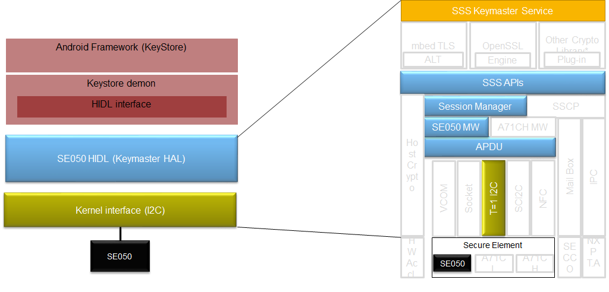

..
    Copyright 2019 NXP

==========================================================
 Stack with SE050
==========================================================

We use Android Keymaster with SE050 over T=1 I2C.
In this setup, we use physical T=1 over I2C Connection
to the Applet.

The Architecture looks like this:

