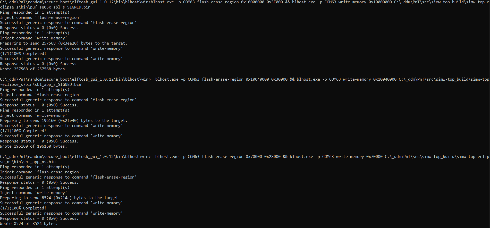

..
    Copyright 2020 NXP

.. highlight:: shell

.. _se05x-puf-secure-binding:

==========================================================
 Secure Boot Demo
==========================================================

This example is to demonstrate how secure binding is achieved 
between LPC55S and SE05X using PUF for secure storage of PlatformSCP 
keys on the MCU. For details on secure boot process, refer to 
:numref:`secure-boot` :ref:`secure-boot`

Secondary Bootloader (SBL)
^^^^^^^^^^^^^^^^^^^^^^^^^^^^^^^^^^^^^^^^^^^^^^^^^^^^^^^^^^

Refer to :numref:`secondary-bootloader` 
:ref:`secondary-bootloader` for details on operations performed 
by the Secondary Bootloader (SBL).

Secure Application
^^^^^^^^^^^^^^^^^^^^^^^^^^^^^^^^^^^^^^^^^^^^^^^^^^^^^^^^^^

The secure application is verified by SBL using RSA2k public 
key stored at KeyID ``K_PUB_OEM_ID``. Secure application 
will have the reference to keyCodes prepared by SBL, using which 
PlatformSCP session can be established.

In this example, secure application is opening a PlatformSCP03 
session using keyCodes prepared by SBL and transfers the control to 
non-secure application which will open an Applet session 
and test communication.

Non-Secure Application
^^^^^^^^^^^^^^^^^^^^^^^^^^^^^^^^^^^^^^^^^^^^^^^^^^^^^^^^^^

The non-secure application used in this example is used to 
establish an Applet session and use non-secure callable 
APIs provided in secure application to wrap data with PlatformSCP 
context before sending to the SE.

Prerequisites
^^^^^^^^^^^^^^^^^^^^^^^^^^^^^^^^^^^^^^^^^^^^^^^^^^^^^^^^^^

- :numref:`platform-lpc55s69` :ref:`platform-lpc55s69`
- :numref:`logging-on-console` :ref:`logging-on-console`
- Building Plug & Trust middleware stack. (Refer :ref:`building`)

- PUF must be enrolled first and original SCP03 keys must be 
  provisioned and ActivationCode and KeyCodes must be updated in 
  :file:`ex_scp03_puf.h`. SBL and secure app should be 
  compiled with the correct AC and KCs.
  See :numref:`puf-inject-scp03` :ref:`puf-inject-scp03` on how to 
  provision PUF with PlatformSCP03 keys.

- Secure application verification public key must be provisioned at 
  keyID ``K_PUB_OEM_ID`` and updated in :file:`puf_se05x_sbl_s.c` at:

  .. literalinclude:: sbl_s/puf_se05x_sbl_s.c
     :language: c
     :start-after: /* doc:start:k-pub-oem-id */
     :end-before: /* doc:end:k-pub-oem-id */

  Refer to :ref:`cli-tool` for details on how to provision keys into 
  SE05x.

- New PlatformSCP03 keys updated in :file:`puf_se05x_sbl_s.c` at:
  
  .. literalinclude:: sbl_s/puf_se05x_sbl_s.c
     :dedent: 8
     :language: c
     :start-after: /* doc:start:new-scp-keys */
     :end-before: /* doc:end:new-scp-keys */

  .. note:: The SBL performs key rotation when run first time with randomized
     keys. If required for development, the user should change this to known keys
     so that in case of failure recovering SE050 is easy.

- ``elftosb`` tool from `ELF to Secure Binary GUI`_ to prepare signed 
  images.

- Also see :numref:`secure-boot` :ref:`secure-boot`

- Refer AppNote `AN12283`_.

How to build
^^^^^^^^^^^^^^^^^^^^^^^^^^^^^^^^^^^^^^^^^^^^^^^^^^^^^^^^^^

1) Compile the SBL with the following CMake options:

   - ``PTMW_Host=lpcxpresso55s_s``

   - ``PTMW_SCP=SCP03_SSS``

   - ``PTMW_SE05X_Auth=PlatfSCP03``

   - ``PTMW_SBL:STRING=None``

   - Project:``puf_se05x_sbl_s``

#) To complete the build process, you also need to sign the image 
   for Bootloader verification. For this, you need to use 
   `ELF to Secure Binary GUI`_.

   Configure elftosb GUI tool as:

   .. image:: img/SBL_signed_binary_creation_config.png

   1) Select your SBL input binary
   #) Add certificate chain and signing key (Refer **Chapter 3. Keys and certificates** in `AN12283`_)
   #) Select your output signed SBL binary

   Press ``Process`` button to create signed image.

   You should be able to see the log generated on right window 
   containing RKTH as highlighted:

   .. image:: img/SBL_signed_binary_creation.png

   Note this value for next step.

#) We will configure CMPA and CFPA pages in next 2 steps. These 
   pages are required to configure LPC55S registers before boot.
   We can configure boot config, boot speed, debugging registers, 
   RKTH, etc (See `AN12283`_ and `AN13037`_ for more details). 
   In this example, we configure CMPA page with RKTH value and 
   CFPA with RoT Keys enabled. RKTH value is checked from CMPA 
   while verifying the image to ensure that a different certificate 
   chain was not used to create the signed binary. CFPA page is used 
   to check if any key used in signed image preparation is enabled 
   or revoked.

   In ``Device`` tab, configure the following settings:
   
   .. image:: img/CMPA_config.png

   In place of RKTH, enter your RKTH that you noted in the previous
   step.

   .. note:: Do **NOT** Seal Security configuration

   Enter ISP mode by holding ISP button on the device and 
   pressing Reset button.

   Update the COMPort and press ``Process``. This will update 
   CMPA page with this RKTH value which will allow ROM Bootloader 
   to successfully verify SBL image.
   On successful programming of CMPA page, you should be able to see 
   logs like this:
   
   .. image:: img/CMPA.png

   .. note:: This will allow to boot only signed images. You won't be 
             able to boot plain images. To revert this setting to boot 
             plain images, change Secure Boot setting to **Boot plain images**
             and update the CMPA page again.

#) Update CFPA page using ``blhost`` utility available in ``elftosb``
   package::

    blhost.exe -p COM54 write-memory 0x9DE00 C:\_ddm\PnT\random\secure_boot\AN12283\CFPA_0x9de00.bin

   .. image:: img/blhost_flash_CFPA.png

   Sample CFPA page is available with this demo which can be 
   directly flashed. If you want to update the CFPA page again, you 
   need to increment the CFPA version. See `AN12283`_ for more details.

#) Compile SBL bootable secure application with the following CMake options:

   - ``PTMW_Host=lpcxpresso55s_s``

   - ``PTMW_SCP=SCP03_SSS``

   - ``PTMW_SE05X_Auth=PlatfSCP03``

   - ``PTMW_SBL=SBL_LPC55S``

   - Project:``sbl_app_s``

#) To prepare Secure application signed image, configure elftosb as:
   
   .. image:: img/S_APP_signed_binary_creation_config.png

   Run process to create signed secure application image.

#) Compile non-secure application with the following CMake options:

   - ``PTMW_Host=lpcxpresso55s_ns``

   - ``PTMW_SCP=SCP03_SSS``

   - ``PTMW_SE05X_Auth=PlatfSCP03``

   - ``PTMW_Log=Silent``

   - Project:``sbl_app_ns``

.. note:: This process creates a signed image for SBL. However, there 
          is an option to create signed + encrypted image. In that, the 
          encrypted image is first decrypted by symmetric key provisioned 
          in PUF, then the decrypted image is loaded in flash for signature 
          verification. Refer to section 5.6 in `AN12283`_ for details on 
          creating Secure Binary (Signed + Encrypted). 
          
          A "Secure" Binary in this case means it is signed and encrypted, 
          it is not related to Secure Boot or LPC55S TrustZone.
          
          Using a Secure Binary would also disable debugging.
          Refer to `AN13037`_ for details on how to update **CC_SOCU** 
          registers in CMPA and CFPA pages to enable debugging. 

How to run
^^^^^^^^^^^^^^^^^^^^^^^^^^^^^^^^^^^^^^^^^^^^^^^^^^^^^^^^^^

Enter ISP mode by holding ISP button on the device and pressing Reset button. 
Flash the built images with these commands::
  
  blhost.exe -p COMxx flash-erase-region 0x10000000 0x3F000 && blhost.exe -p COMxx write-memory 0x10000000 puf_se05x_sbl_s_SIGNED.bin

  blhost.exe -p COMxx flash-erase-region 0x10040000 0x30000 && blhost.exe -p COMxx write-memory 0x10040000 sbl_app_s_SIGNED.bin

  blhost.exe -p COMxx flash-erase-region 0x70000 0x28000 && blhost.exe -p COMxx write-memory 0x70000 sbl_app_ns.bin

Press the Reset button after completion. On successful execution you should 
be able to see these logs:

**First boot log:**

::

    App   :INFO :PlugAndTrust_v03.01.00_20210102
    sss   :INFO :atr (Len=35)
                    01 A0 00 00     03 96 04 03     E8 00 FE 02     0B 03 E8 00
                    01 00 00 00     00 64 13 88     0A 00 65 53     45 30 35 31
                    00 00 00
    App   :INFO :Applet selection successful!
    App   :INFO :Random test was successful with default SCP03 keys
    sss   :INFO :atr (Len=35)
                    01 A0 00 00     03 96 04 03     E8 00 FE 02     0B 03 E8 00
                    01 00 00 00     00 64 13 88     0A 00 65 53     45 30 35 31
                    00 00 00
    App   :INFO :Applet deselection successful!
    App   :INFO :Key Rotation was successful!
    App   :INFO :NewKeyCode_ENC (Len=52)
                    00 00 00 02     E2 26 23 39     CB 6F D3 57     46 75 7D 7E
                    47 9C F4 68     D6 65 D4 8C     3D CF 28 4F     1F 3F 9D 4A
                    66 1F E3 D1     BB B0 0A D7     57 C3 35 3B     48 17 1B AF
                    33 AE 2C A6
    App   :INFO :NewKeyCode_MAC (Len=52)
                    00 00 00 02     10 F9 83 8B     91 BD 14 5E     6D 57 4A C2
                    46 13 7A 71     38 8D 14 05     99 B3 08 13     EE 1B 68 9E
                    36 E6 99 4B     EC 1B BB 48     2D 50 58 D1     16 6E F3 3D
                    8D 2F 18 41
    App   :INFO :NewKeyCode_DEK (Len=52)
                    00 00 00 02     4D F1 02 83     E7 B9 C5 30     66 DB 92 43
                    86 7E 3C E2     A3 61 FF 48     72 C9 AE 68     03 31 6C 7B
                    6F C9 5C E4     28 BC D1 3F     B6 DD 6C C9     AF 65 D8 B0
                    0B 38 E2 E6
    sss   :INFO :atr (Len=35)
                    01 A0 00 00     03 96 04 03     E8 00 FE 02     0B 03 E8 00
                    01 00 00 00     00 64 13 88     0A 00 65 53     45 30 35 31
                    00 00 00
    App   :INFO :Applet selection successful!
    App   :INFO :Session Open successful
    App   :INFO :Random test was successful with new SCP03 keys
    App   :INFO :Image verification successful, booting the application now!
    sss   :INFO :atr (Len=35)
                    01 A0 00 00     03 96 04 03     E8 00 FE 02     0B 03 E8 00
                    01 00 00 00     00 64 13 88     0A 00 65 53     45 30 35 31
                    00 00 00
    App   :INFO :Applet deselection successful!
    sss   :INFO :atr (Len=35)
                    01 A0 00 00     03 96 04 03     E8 00 FE 02     0B 03 E8 00
                    01 00 00 00     00 64 13 88     0A 00 65 53     45 30 35 31
                    00 00 00
    App   :INFO :Applet selection successful!
    App   :INFO :Random test was successful from secure application
    App   :INFO :Entering normal world see you there.

    Non-secure entry
    NS Channel initialize successful
    sss:WARN :Communication channel is Plain.
    sss:WARN :!!!Not recommended for production use.!!!
    NS Session open is Successful
    sss_rng_get_random successful

**Next boot log:**

::
    
    App   :INFO :PlugAndTrust_v03.01.00_20210102
    sss   :INFO :atr (Len=35)
                    01 A0 00 00     03 96 04 03     E8 00 FE 02     0B 03 E8 00
                    01 00 00 00     00 64 13 88     0A 00 65 53     45 30 35 31
                    00 00 00
    App   :INFO :Applet selection successful!
    App   :INFO :Random test was successful, with KCs loaded from Flash!
    App   :INFO :Image verification successful, booting the application now!
    sss   :INFO :atr (Len=35)
                    01 A0 00 00     03 96 04 03     E8 00 FE 02     0B 03 E8 00
                    01 00 00 00     00 64 13 88     0A 00 65 53     45 30 35 31
                    00 00 00
    App   :INFO :Applet deselection successful!
    sss   :INFO :atr (Len=35)
                    01 A0 00 00     03 96 04 03     E8 00 FE 02     0B 03 E8 00
                    01 00 00 00     00 64 13 88     0A 00 65 53     45 30 35 31
                    00 00 00
    App   :INFO :Applet selection successful!
    App   :INFO :Random test was successful from secure application
    App   :INFO :Entering normal world see you there.

    Non-secure entry
    NS Channel initialize successful
    sss:WARN :Communication channel is Plain.
    sss:WARN :!!!Not recommended for production use.!!!
    NS Session open is Successful
    sss_rng_get_random successful

.. Links
.. _ELF to Secure Binary GUI: https://www.nxp.com/webapp/Download?colCode=elftosb_gui_1.0.12&appType=license&location=null

.. _AN12283: https://www.nxp.com/docs/en/application-note/AN12283.pdf

.. _AN13037: https://www.nxp.com/docs/en/application-note/AN13037.pdf
