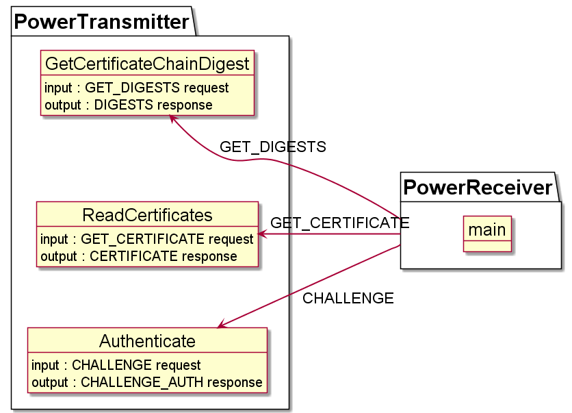

..
    Copyright 2022 NXP

.. highlight:: bat

.. _ex-se05x-qi-auth:

=======================================================================
 Secure Authenticator (Qi) Authentication demo
=======================================================================

.. contents::
    :backlinks: none
    :local:

This project is used to demonstrate the Qi authentication flow between a Power Transmitter and 
a Power Receiver. The Power Transmitter implements 3 functions for the 3 authentication requests 
a Receiver can issue to the Transmitter : ``GetCertificateChainDigest``, ``ReadCertificates``, ``Authenticate``.

Pre-requisites
=======================================================================

- The secure element should be trust provisioned with correct keys and 
  certificates for Qi Authentication. Keys and certificates can be provisioned 
  for test purpose by updating keys in :file:`demos/se05x/sa_qi_provisioning/sa_qi_credentials.c`
  and running example :ref:`ex-se05x-qi-provisioning`.

- By default WPC Root certificate is used in the certificate chain.
  If example :ref:`ex-se05x-qi-provisioning` is run, you would need to disable 
  macro ``USE_ROOT_WPCCA`` in :file:`sa_qi_rootcert.c` to use test RootCA:

  .. literalinclude:: sa_qi_auth/sa_qi_rootcert.c
      :language: c
      :start-after: /* doc:start:qi-UseRootWpcCert */
      :end-before: /* doc:start:qi-UseRootWpcCert */

GetCertificateChainDigest (GET_DIGESTS)
=======================================================================

This function reads the digests of certificate chains stored inside the secure element
and returns all the digests as requested by the Power Receiver.

.. literalinclude:: sa_qi_transmitter_auth/sa_qi_transmitter.c
    :language: c
    :start-after: /* doc:start:qi-GetCertificateChainDigest */
    :end-before: /* doc:end:qi-GetCertificateChainDigest */

ReadCertificates (GET_CERTIFICATE)
=======================================================================

This function reads the certificate chain on the provided slot ID starting 
from the provided offset and reading provided length bytes.

If the provided offset exceeds ``0x600`` then that indicates the power 
transmitter to offset from the Product Unit Certificate. Otherwise the offset
starts from the beginning of the certificate chain.

.. literalinclude:: sa_qi_transmitter_auth/sa_qi_transmitter.c
    :language: c
    :start-after: /* doc:start:qi-ReadCertificates */
    :end-before: /* doc:end:qi-ReadCertificates */

Authenticate (CHALLENGE)
=======================================================================

This function performs the CHALLENGE operation and returns the signature ``R`` 
and signature ``S`` values to the power receiver.

.. literalinclude:: sa_qi_transmitter_auth/sa_qi_transmitter.c
    :language: c
    :start-after: /* doc:start:qi-Authenticate */
    :end-before: /* doc:end:qi-Authenticate */

Building the Demo
=======================================================================

- Build Plug & Trust middleware stack. (Refer :ref:`building`)

Select CMake options:

- ``PTMW_SE05X_Ver=07_02``

.. note:: If you have run :ref:`ex-se05x-qi-provisioning`, do not select 
  ``PTMW_SE05X_Auth=AESKey``

Build project:

- Project: ``sa_qi_auth``

Running the Example
=======================================================================

If you have built a binary, flash the binary on to the board and reset
the board.

If you have built an *exe* to be run from Windows using VCOM, run as::

    sa_qi_auth.exe <PORT NAME>

Where **<PORT NAME>** is the VCOM COM port.

On successful execution you should be able to see logs as:

.. literalinclude:: doc/qi_auth_log.rst.txt

Porting
=======================================================================

The example allows porting of host verification and host RNG functions
in case mbedTLS is not available. If you want to add your own implementation
of these operations, update the following APIs in :file:`sa_qi_auth/port/sa_qi_helper_port.c`:

.. literalinclude:: sa_qi_auth/port/sa_qi_helper_port.c
 :start-after: /* doc:start:qi-auth-port */
 :end-before: /* doc:end:qi-auth-port */
 :language: c

